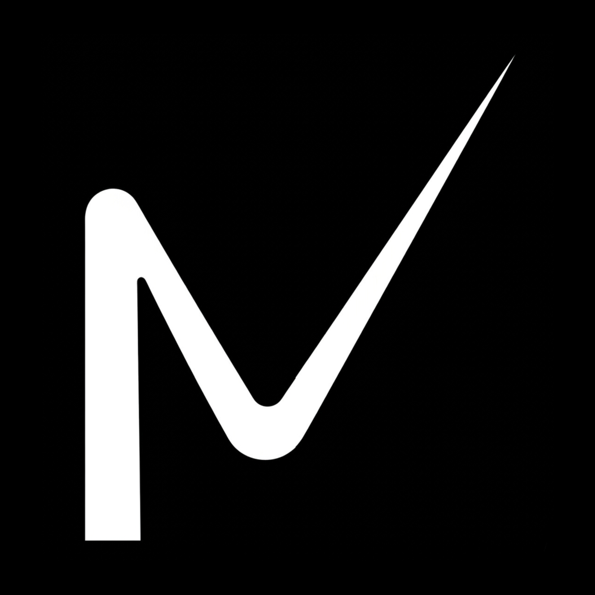

<div align="center">
  
  <h1>NEURALITECH STRATEGIC SOLUTIONS</h1>
  <p><em>Empowering Innovation, Advanced Cyber Security & Digital Transformation</em></p>
  
  <p>
    
    
    
  </p>
</div>

---

## 🚀 About Neuralitech

**PT Neuralitech Strategic Solutions** is a modern technology agency and a leading strategic partner for digital transformation in Indonesia. The company operates on four main ecosystem pillars:
1. **Research & Development (R&D):** Focusing on aggressive research and innovation in Artificial Intelligence (AI) and Blockchain engineering.
2. **Software House:** Provider of multi-tier custom software solutions, including Websites, Mobile Apps, and Custom SaaS (Software as a Service) systems.
3. **Advanced Cyber Security:** A dedicated cybersecurity division with 7 years of professional experience, automatically integrated into every product service to ensure high-level system resilience.
4. **Neuralitech Academy:** Interactive vocational training programs and technology bootcamps designed to educate and shape future digital talents.

---

## 🛠️ Ecosystem & Services

| Core Services | Description | Target Level |
| :--- | :--- | :--- |
| **Custom Web Development** | Designing highly interactive, secure, and scalable websites tailored precisely to business needs. | Entry, Professional, Business, Enterprise Level |
| **Mobile Apps Development** | Developing high-performance and stable mobile applications with optimal UI/UX. | Business & Enterprise Level |
| **SaaS Systems** | Engineering adaptive and scalable Software as a Service systems to streamline internal management. | Custom Corporate Solutions |
| **Advanced Cyber Security** | Certified advanced cyber protection integrated automatically, alongside standalone security audits for client systems. | Integrated & Dedicated Services |
| **Neuralitech Academy** | Educational platform providing tech training for youth, professionals, and business owners. | Public & Professionals |

---

## ⚙️ Project Architecture & Features

* **Responsive Frontend UI/UX:** Built using modern design frameworks combined with smooth, interactive animations (utilizing Swiper.js for the portfolio slider and Typed.js for dynamic text).
* **Secure Backend Integration:** Features a robust PHP-based form handling system with strict input validation, coupled with a secure file scanning mechanism that restricts uploads strictly to safe PDF documents (Company Profile/CV).
* **Anti-Inspection & Content Protection:** Secured by anti-right-click scripts, restriction of developer tools (DevTools) keyboard shortcuts, and media drag/download protection to safeguard digital assets.

---

## 📂 Project Structure

```text
├── admin/
│   ├── dbconn.php          # Main database connection configuration
│   └── simpandata/         # Directory for safely storing client uploaded PDF files
├── css/
│   ├── styles.css          # Main custom stylesheet for UI styling
│   └── vendor.css          # External vendor stylesheets
├── images/                 # Graphic assets, portfolio showcases, and client/partner icons
├── js/
│   ├── main.js             # Main frontend interactive logic script
│   └── plugins.js          # JavaScript supporting plugins/libraries
└── index.php               # Main Landing Page containing the core UI and form processing logic
